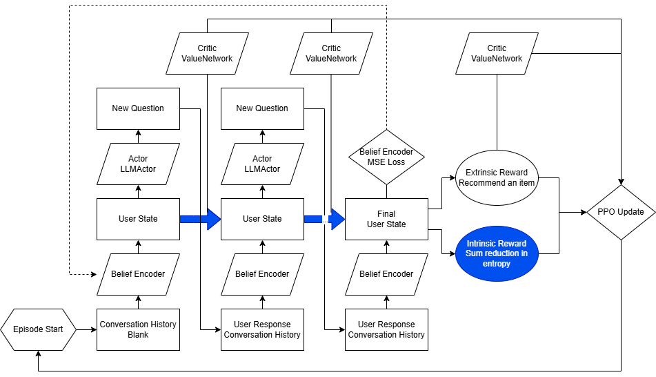
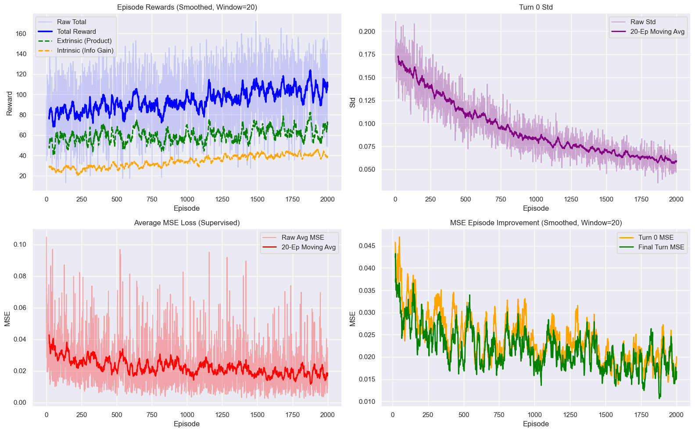

# Latent Preference-Based LLM Shopping Agent

## Overview

Traditional LLM-based shopping assistants typically rely on preferences that users explicitly state, which can limit their ability to understand the underlying factors that influence purchasing decisions.

This project develops a **personalized LLM shopping agent that actively learns latent user preferences through multi-turn dialogue**. The agent combines uncertainty-driven questioning with continuous latent preference modeling, allowing it to identify what it does not know about a user, ask targeted questions, update its internal preference representation, and use that information to recommend products.

The proposed hybrid approach combines ideas from **CURIO (Curiosity-driven User-modeling Reward as an Intrinsic Objective)** and **Variational Preference Learning (VPL)** and evaluates them using a 10,000-item product catalog.

## Data & Preference Representation

The recommendation environment uses the **WebShop catalog**, containing 10,000 products.

Each product is represented using eight latent preference dimensions:

- Comfort
- Functionality
- Maintenance
- Status symbol
- Modesty
- Sustainability
- Risk tolerance
- Trend sensitivity

Simulated users were generated using 20 demographic and behavioral attributes. These attributes were mapped to distributions over the eight latent preference dimensions to introduce variation and uncertainty into user preferences.

The simulated users were divided into:

| Split | Users |
| --- | ---: |
| Training | 1,000 |
| Validation | 125 |
| Testing | 125 |

## Approach

Three preference-learning approaches were implemented and evaluated.

### CURIO

CURIO models preference elicitation as a reinforcement learning problem. The agent maintains a discrete belief distribution over user types and uses an actor-critic policy to select questions that reduce uncertainty about the user's preferences.

Its reward combines an **intrinsic reward for information gain** with an **extrinsic reward based on recommendation quality**.

### Variational Preference Learning (VPL)

VPL represents each user's preferences as a continuous latent vector rather than a discrete user type.

A variational encoder learns a Gaussian posterior over the latent preference space from pairwise product comparisons. As additional feedback is received, the posterior is updated and used to rank candidate products.

### Hybrid Agent: CURIO + VPL

Our proposed agent combines the strengths of both approaches.

Like VPL, it maintains a **continuous Gaussian belief over the eight latent preference dimensions**. Like CURIO, it uses uncertainty as a signal for deciding which questions to ask.

<p align="center">
  
</p>

<p align="center">
  <em>Architecture of the proposed hybrid preference-learning agent.</em>
</p>

After each user response, the conversation history is processed by a belief encoder to update the estimated mean and uncertainty of the user's latent preference vector.

The agent receives an **intrinsic reward when a question reduces uncertainty** and an **extrinsic reward based on the quality of the final product recommendation**. These signals are used to train the question-selection policy using Proximal Policy Optimization (PPO).

## Evaluation

Recommendation performance was evaluated using several metrics:

- **Regret** – difference between the utility of the optimal product and the recommended product
- **Normalized Regret** – regret normalized by the maximum possible regret for the episode
- **Success@K** – whether the recommended product appears among the user's top-K products
- **Threshold Success Rate** – whether the recommendation falls within the top utility region
- **Uncertainty Reduction** – how much uncertainty about the user's preferences is reduced during interaction

## Training

The hybrid agent was trained for **2,000 episodes** while monitoring recommendation rewards, uncertainty, and latent-preference estimation error.

<p align="center">
  
</p>

<p align="center">
  <em>Training diagnostics for the hybrid agent.</em>
</p>

During training, the belief encoder became increasingly confident in its estimate of the average user's latent preferences. At the same time, the increase in intrinsic reward suggested that the policy was learning to ask questions that helped refine those estimates for individual users.

## Results

The three approaches were evaluated on the same recommendation environment.

| Metric | CURIO | VPL | **Hybrid Agent** |
| --- | ---: | ---: | ---: |
| Avg. Regret | 0.1675 | **0.0186** | 0.1342 |
| Avg. Normalized Regret | 0.0651 | 0.0588 | **0.0508** |
| Success@100 | 0.015 | **0.288** | 0.064 |
| Success@200 | 0.100 | **0.336** | 0.072 |
| Success@500 | 0.570 | 0.560 | **0.592** |
| Success@1000 | 0.700 | 0.736 | **0.752** |
| Avg. Uncertainty Reduction / Turn | 0.0282 | **0.776** | 0.4220 |


The hybrid agent achieved the **highest Success@500 and Success@1000**, placing relevant products within the upper portion of the 10,000-item catalog more consistently than the two baseline approaches. It also achieved the **lowest normalized regret of 0.0508**.

VPL performed better at the more restrictive Success@100 and Success@200 thresholds and achieved the lowest raw average regret. However, VPL receives explicit pairwise product preference feedback, while CURIO and the hybrid agent infer preferences from natural-language dialogue.

## Ablation Study

An ablation study was conducted to evaluate the contributions of the intrinsic and extrinsic reward components.

| Metric | Remove Extrinsic | Remove Intrinsic | **Full Model** |
| --- | ---: | ---: | ---: |
| Avg. Regret | 0.1472 | 0.1599 | **0.1342** |
| Avg. Normalized Regret | 0.0566 | 0.0618 | **0.0508** |
| Success@500 | 0.584 | 0.568 | **0.592** |
| Success@1000 | 0.712 | 0.712 | **0.752** |

The full model produced the strongest overall recommendation performance. Removing the intrinsic reward had a larger negative effect than removing the extrinsic reward, highlighting the importance of encouraging the agent to ask informative, uncertainty-reducing questions.

## Conclusion

The results demonstrate that combining **continuous latent preference modeling with uncertainty-driven questioning** can improve personalized product recommendations in a large product catalog.

Rather than relying only on explicitly stated preferences, the hybrid agent actively identifies uncertainty about the user and learns a policy for asking questions that reveal relevant latent preferences. The resulting model achieved a **75.2% Success@1000 rate** and the **lowest normalized regret of 0.0508** among the evaluated approaches.

The results also highlight an important tradeoff between conversational preference elicitation and more explicit preference feedback. While VPL performed particularly well when given pairwise product comparisons, the hybrid agent was able to infer preferences directly from natural-language interactions while maintaining strong large-scale ranking performance.

Future work could extend this approach to real users, where true latent preference vectors are unavailable, and explore methods that learn the latent preference dimensions rather than defining them in advance.

## Technologies & Methods

`Python` · `Large Language Models` · `LLM Agents` · `Reinforcement Learning` · `PPO` · `Preference Learning` · `Recommender Systems` · `Latent Variable Modeling` · `PyTorch`

## Repository Structure

```text
.
├── README.md
├── report.pdf
│
├── code/
│   └── ...
│
└── figures/
    ├── combined_model_pipeline.png
    ├── model_training_diagnostics.png
    └── model_comparison.png
```

## Full Report

For a detailed discussion of the agent architecture, preference-learning methods, experiments, ablation study, and results, see the [full project report](report.pdf).
